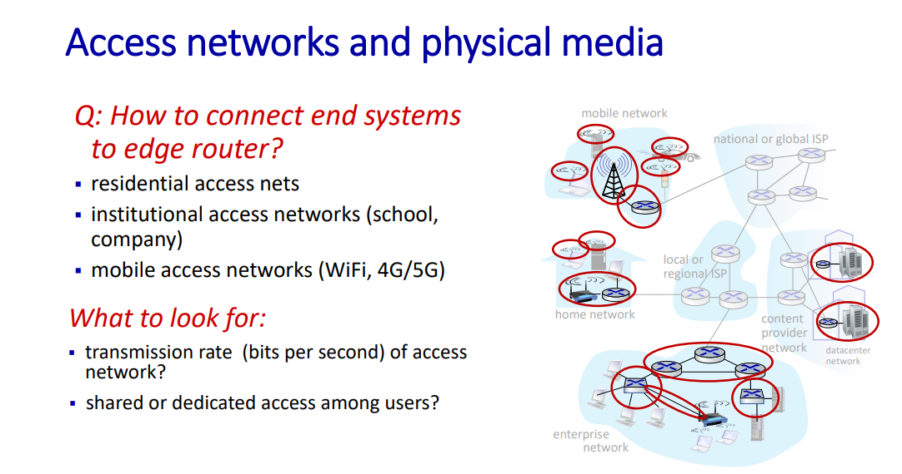
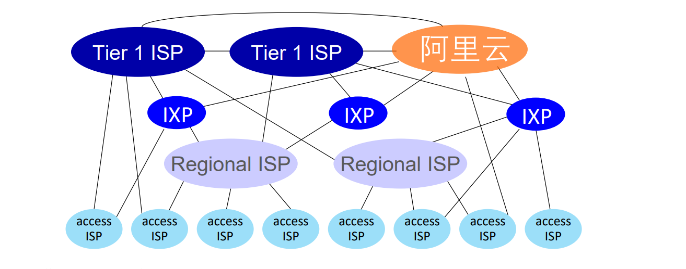

# 计算机网络：自顶向下方法(Computer Networking : A Top-Down Approach) 术语概念整理

> **Author:  MQ_Adventure**
>
> **Duration:  June, 2022**

[TOC]

## 第一章：计算机网络和因特网

### 1.1 什么是因特网

主机 (host) / 端系统 (end system)

通信链路 (communication link)

分组交换机 (packet switch)：包括路由器和链路层交换机，作用：==forward packets==

传输速率 (transmission rate): bandwidth

分组 (packet)

路由器（router）

链路层交换机（link-layer switch）

路径（path）：一个分组所经历的一系列通信链路和分组交换机成为通过该网络的路径

因特网服务提供商 （ISP）：端系统通过 ISP 接入因特网，ISP 自身就是一个由多台分组交换机和多段通信链路组成的网络

请求评论（RFC）& 因特网工程任务组（IETF）: ==互联网标准==

套接字接口（socket interface）：一套发送程序必须遵循的规则集合

协议（protocol）：定义了在两个或多个==通信实体==之间交换的报文的==格式（format）和顺序(order)==，以及报文发送和/或接受一条报文或其他时间所==采取的动作(action taken)==

***

### 1.2 网络边缘

接入网（access network）: 将端系统物理连接到其边缘路由器的网络

数字用户线（DSL）& 数字用户线接入复用器（DSLAM）：在==用户==一侧，一个分配器把到达家庭的数据信号和电话信号分隔开，并将数据信号转发给 DSL 调制解调器； 在==电话公司==，DSLAM 把数据和电话信号分隔开，并将数据送往因特网。

电缆（fiber cable）: 共享广播媒体

数字用户线接入复用器（DSLAM）：将数据和电话信号分隔开，并将数据送往因特网

不对称接入（asymmetric）：上行速率和下行速率不同

混合光线同轴（HFC）：同时使用光纤和同轴电缆

物理媒体：同轴电缆（coaxial cable）、光纤（fiber opic cable）、卫星（satellite）

***

### 1.3 网络核心

存储转发传输（store-and-forward transmission）：在交换机能够开始向输出链路传输该分组的第一个比特之前，必须接收到整个分组

输出缓存（output buffer）

排队时延（queuing delay）

分组丢失（packet loss）

路由选择协议（routing protocol）

电路交换（circuit switching）：dedicated resource，no sharing，恒定速率，预留资源（缓存，链路传输速率）

分组交换（packet switching）：更好的带宽共享，更加简单高效，实现成本更低

频分复用（FDM）：different channels transmitted in different frequency bands（不同的频道在不同的带宽里面传输）

时分复用（TDM）：不同的频道在不同的时隙里面传输

存在点（PoP）:其中客户 ISP 可以与提供商 ISP 连接

多宿（multi-home）：可以与两个或者更多提供商 ISP 连接

对等 （peer）：可以直接将相同等级结构的 ISP 连接，使得它们之间的所有流量经过直接连接而不是通过上游的中间 ISP 传输

因特网交换点（IXP）：是一个汇合点，多个 ISP 能够在这里一起对等

内容提供商网络（content provider network）: ==private network== that connects its data  centers to Internet, often bypassing tier-1, regional ISPs

***

### 1.4 分组交换网中的时延、丢包和吞吐量

处理时延（processing delay）: 检查分组首部和决定将该分组导向何处所需要的时间等等处理时间

排队时延（queuing delay）：取决于网络的拥塞程度

传输时延（transmission delay）：将所有分组的比特推向链路所需要的时间

传播时延（propagation delay）：从链路起点到路由器传播所需要的时间

流量强度（traffic intensity）：$La/R\ \ (a 是分组到达队列的平均速率，L 是一个分组含有的比特数量)$

端到端时延：$d_{end-to-end} = N(d_{proc} + d_{trans} + d_{prop})$

瓶颈链路（bottleneck link）: ==link on end-end path that constrains end-end throughput==

***

### 1.5 协议层次及其服务模型

协议栈（protocol stack）：各层的所有协议

报文（message）：位于应用层的信息分组

报文段（segment）：位于运输层的分组

数据报（datagram）：位于网络层的分组

帧（frame）：链路层分组

***

### 1.6 面向攻击的网络

病毒（virus）：需要某种形式的用户交互来感染用户设备的软件

蠕虫（worm）：一种无须任何明显用户交互就能进入设备的恶意软件

拒绝服务攻击（Denial-of-Service (DoS) attack）： 1. select target 2. break into hosts around the network 3. send packets to target from compromised hosts.

分组嗅探器（packet sniffer）

IP 哄骗（IP spoofing）: 将具有虚假源地址的分组诸如因特网

如何连接端系统和边缘路由器：接入网（access network）（家庭接入网，机构接入网（以太网））

互联接入 ISP 的中心目标：使得所有端系统能够彼此发送分组

OSI 比传统的五层协议结构多出来会话层以及表示层

链路层交换机实现了第一层和第二层，路由器实现了第一层到第三层协议栈

一个分组具有两种类型的字段：首部字段和有效载荷字段(payload field)

DoS攻击类型：弱点攻击，带宽洪泛，连接洪泛

## 第二章：应用层

### 2.1 应用层协议原理

**客户-服务器体系结构**

- 客户相互之间不直接通信
- 服务器总是开启，并且有固定的周知的地址，也就是 IP 地址

**P2P体系结构**

- 可扩展性（scalability）好
- 客户端之间可以直接通信

在相同端系统之间的进程使用进程间通信机制相互通信，在不同端系统之间的进程通过跨越计算机网络交换报文而相互通信。

套接字是同一台主机内应用层和运输层之间的接口。

标识进程需要的信息：1. 主机地址  2.在目的主机中指定接收进程的标识符

应用程序对运输层协议的要求：

- 可靠数据运输（是否可以确保由应用程序的一段发送的数据正确、完全地交付给该应用程序的另一端）
- 吞吐量保证（具有吞吐量要求的应用成为带宽敏感的应用）
- 定时保证
- 安全性

TCP 服务模型包括 1. 面向连接服务 2. 可靠数据传输服务

TCP 和 UDP 都没有提供加密机制，且不能够提供定时和吞吐量的保证

***

### 2.2 Web 和 HTTP

Web 的应用层协议是超文本传输协议（HTTP）

Web 页面是由对象组成的，一个 HTML 文件也是一个对象，每个对象都存储在服务器端，每个对象由 URL 进行寻址，每个 URL 地址包含主机名 + 路径名

HTTP 使用 TCP 作为它的支撑运输协议，并且 HTTP 是一个无状态协议（stateless protocol）

持续连接（persistent connection）：所有的请求及其相应经相同的 TCP 连接发送，HTTP 在默认方式下使用持续连接

往返时间（Round-Trip Time, RTT）: 一个短分组（即不考虑传输时延）从客户到服务器然后再返回客户所花费的时间。包括分组传播时延、分组在中间路由器和交换机上的排队时延和分组处理时延。由于涉及到三次握手，所以总的相应时间就是两个 RTT （一个用于建立 TCP 连接，一个用于请求以及接受对象）加上服务器传输 HTML 文件的时间。

HTTP 报文使用 ASCII 文本书写

==HTTP 请求报文==至少有一行，为请求行（request line），有三个字段（方法字段（GET, POST,...），URL 字段以及 HTTP 版本字段）。后继的就称为首部行（header line）。请求报文最后是实体体，如果使用 GET 方法，实体体为空，如果使用 POST 方法，实体体用来提交表单。

==HTTP 响应报文== 有三个部分，一个初始状态行（status line）（状态行有三个部分，协议版本字段、状态码以及相应状态信息），一个首部行，一个实体体（报文的主要部分）。

==HTTP响应报文首部行==里面的 Date 信息是指服务器检索、插入、发送该响应报文的时间，而不是对象创建或者最后修改的时间。而 Last-Modified：才是指示了对象创建或者最后修改的日期和时间。Content-Length：首部行指示了被发送对象中的字节数。

==Cookie 技术==四大组件：

- HTTP 响应报文当中的 cookie 首部行（Set-cookie: xxxx）
- HTTP 请求报文中的 cookie 首部行 (Cookie: xxxx)
- 在用户端系统中保留有一个 cookie文件，并由用户浏览器管理
- 位于 Web 站点的一个后端数据库

在用户端系统拥有对应网页的 cookie 文件之后，每请求一个 Web 页面，其浏览器都会查询该 cookie 文件并抽取她对这个网站的识别码，放到请求报文中包括识别码的 cookie 首部行中。

Web 缓存器（Web cache），代理服务器（proxy server）。可以大大减少对客户请求的响应时间，并且可以大大减少一个机构的接入链路到因特网的通信量。

==条件 GET  方法==，如果 1. 请求报文使用 GET 方法 2. 请求报文中包含一个 If-Modified-Since 首部行，那么这个报文就是一个条件 GET 请求报文。条件 GET 报文是 Web 代理缓存向服务器发起的，如果在该日期之后没有被修改，服务器不会在响应报文中包含该对象

***

### 2.3 因特网中的电子邮件

因特网电子邮件的三大部分：用户代理（user agent）、邮件服务器（mail server）、简单邮件传输协议（SMTP）

SMTP 基于 TCP，报文体部分只能使用 7比特 ASCII 表示。而使用HTTP传送前不需要将多媒体数据编码为 ASCII 码

SMTP 不使用中间邮件服务器发送邮件，如果没有发送成功，那么邮件就会停留在发送方的邮件服务器当中，等待新的尝试。

在 SMTP ==握手的阶段==，SMTP客户指示发送方的邮件地址和接收方的邮件地址。且报文的发送是==持续性==的，建立在相同的TCP 之上。

对于 SMTP 的每个报文，客户用一个新的 MAIL FROM 开始，用一个独立的句点指示该邮件的结束，即以 CRLF . CRLF 指示报文的结束，并且仅当所有邮件发送完成之后才会发送 QUIT。

SMTP 与 HTTP 之间的对比：

- HTTP 主要是一个 拉协议（pull protocol），而 SMTP 是一个推协议（push protocol）
- SMTP 要求每个报文采用7比特 ASCII 码格式，而 HTTP 数据不受这种限制
- HTTP 把每个对象都封装到它自己的 HTTP 相应报文当中，即一个对象对应一个报文，而 SMTP 则把所有报文对象放在一个报文当中

SMTP 报文格式：首部行 + 空白行 + 报文体

首部行中的 FROM: 和 TO: 不同于之前的 SMTP 命令，前者是 SMTP 报文的一部分，而后者是 SMTP 握手协议的一部分。

邮件发送过程：发送方代理 ->（SMTP） 发送方邮件服务器  ->(SMTP) 接收方邮件服务器 ->==（POP3、IMAP 或者 HTTP）== 接收方用户代理

POP3 工作流程：特许（authorization）(通过用户名以及口令鉴别用户)、事务处理、更新（出现在quit之后，结束POP会话并且删除在事务处理中标记为删除的报文）

下载并删除与下载并保留的区别在于用户下载邮件之后在其他客户端是否仍然可以访问该邮件。

在用户代理与邮件服务器之间的POP3会话期间，POP3服务器会保留状态信息，但是并不会在会话期间携带状态信息

POP3 协议没有给用户提供任何创建远程文件夹并为报文指派文件夹的方法，而 IMAP 有在远程创建文件夹以及将邮件从一个文件夹移动到另一个文件夹的命令。IMAP 另一个重要的特性在于允许用户代理处理获取报文某些部分的命令。

用户代理从邮件服务器获取邮件还可以通过 HTTP 协议实现。但是，邮件服务器在于其他的邮件服务器之间发送和接收邮件时，仍然使用的是 SMTP

***

### 2.4 DNS: 因特网的目录服务

DNS 协议建立在 UDP 之上，使用 53 号端口

DNS 服务：

- 主机名到 IP 地址的转换
- 主机别名（host aliasing），获得规范主机名（canonical  hostname）
- 邮件服务器别名（mail server aliasing）
- 负载分配（load distribution）

DNS 服务器集中式设计带来的问题：

- 单点故障（a single point of failure）
- 通信容量（traffic volume）
- 远距离的集中式数据库（distant centralized database）
- 维护（maintenance）

三中类型的 DNS 服务器：根 DNS 服务器、顶级域（TLD）服务器、权威DNS服务器

本地DNS 不属于服务器的层次结构，每个 ISP 都有一台本地的 DNS 服务器

递归查询（recursive query）和迭代查询（iterative query）

从请求主机到本地 DNS 服务器的查询是递归的，其余的查询是迭代的。

资源记录是四元组（Name, Value, Type, TTL）, TTL 是该记录的生存时间，决定了资源记录应当从缓存中删除的时间

获得邮件服务器的规范主机名使用 MX，获得其他服务器的规范主机名使用 CNAME

一个主机名能够有多个 IP的原因？在DNS 回答报文中的回答区域中可以包含多条RR。

***

### 2.5 P2P 文件分发

参与一个特定文件分发的所有对等方的集合被称为一个洪流（Torrent）

最稀缺优先（rarest first）: 针对一个对等方没有的块在它的邻居中决定最稀缺的块，并且首先请求那些最稀缺的块。目标是均衡每个块在洪流中的副本数量。

一报还一报（tit-for-tat）：10秒计算一次最高速率流入的4个邻居，30秒随机选择一个邻居向其发送块。

***

### 2.6 视频流和内容分发网

对流式视频的最为重要的性能度量是平均端到端吞吐量

经 HTTP 的动态适应性流（Dynamic Adaptive Streaming over HTTP, **DASH**）,将视频编码成几个不同的版本，每个版本具有不同的比特率，对应于不同的质量水平。客户使用 HTTP GET 请求一次选择一个不同的块。客户首先请求的是告示文件，得知各种各样的版本。

CDN 服务器安置原则

- 深入（靠近端用户，改善用户感受时延和吞吐量）
- 邀请做客（将集群放在IXP中）

在请求的时候，权威服务器会将DNS请求移交给对应的CDN进行处理，然后LDNS会请求对应 的 CDN

集群选择策略：

- 地理上最为邻近（geographically closest）
- 实时测量（real-time measurement）

***

### 2.7 套接字编程：生成网络应用

## 第三章：运输层

### 3.1 概述和运输层服务

运输层是在端系统中而不是在路由器中实现的

网络层提供不同主机之间的通信，而运输层提供不同主机之间进程的逻辑通信.

### 3.2 多路复用和多路分解

多路复用与多路分解：将网络层提供的==主机到主机==交付服务延伸到主机上的应用程序提供==进程到进程==的交付服务

==多路复用（multiplexing）==：在源主机从不同套接字中收集数据块，并为每个数据块封装上首部信息，从而生成报文段（segment），然后将报文段传递到网络层。要求是：1. 套接字有唯一标识符。 2. 每个报文段有特殊字段（==源端口号字段==和==目的端口号字段==）来指示该报文段所要交付到的套接字。

==多路分解（demultiplexing）==: 将运输层报文段中的数据交付到正确的套接字的工作。

一个 UDP 套接字是由包含==目的 IP 地址 和一个目的端口号==的二元组标识的。 UDP 多路分解只看目的端口号。

TCP 套接字是由一个四元组==（源 IP 地址，源端口号，目的 IP 地址，目的端口号）==来标识的。TCP 多路分解需要看 4元组

***

### 3.3 无连接运输：UDP

使用 UDP 的应用是可能实现可靠数据传输的，可以通过在应用程序自身中建立可靠性机制来完成。

UDP 报文头部仅仅包括 源端口号、目的端口号（用于定位套接字来执行分解功能）、长度字段（指示UDP报文段中的字节数（==首部 + 数据==））以及==检验和==字段，总共==8==字节。

UDP 检验和，发送方的 UDP 对报文段中的所有 16 比特字的和进行反码运算，求和遇到的任何溢出都要进行回卷，最后对结果取反码。接收方认证的时候将所有结果相加，如果和不是全1，则代表出错。

UDP 提供了差错检测，但是不能差错恢复。

检验和作用：检测在一个传输分组中的比特错误

***

### 3.4 可靠数据传输原理

自动重传请求协议（ARQ）处理比特差错情况：1. 差错检测 2. 接收方反馈（ACK, NAK） 3. 重传

停等协议（stop-and-wait）: 在发送方确信接收方已正确接收分组之前，发送方不会发送新数据这样的协议

解决流水线差错的办法：回退N步（GBN）以及选择重传（SR）

对 GBN （滑动窗口）协议，限制发送但未确认的分组数量，为了进行流量控制。

在 GBN 协议当中，对序号为 n 的分组的确认采取累积确认（cumulative acknowledgement）的方式，也就是说，表明接收方已经正确接收到序号为 n 的以前且包括n在内的所有分组。

定时器：用于超时重传一个分组。

***

### 3.5 面向连接的运输：TCP

TCP 是面向连接的（connection-oriented）、全双工（full-duplex service）的、点对点的（point-to-point）

TCP 从缓存中取出并放入报文段的数据数量受限于最大报文段长度（MSS），MSS 需要根据最大链路层帧长度（最大传输单元（MTU））来设置。设置 MSS 要保证一个TCP报文段加上 TCP/IP 首部长度将适合单个链路层帧。MSS 是指在报文段里==应用层数据的最大长度==，而不是指包括首部的TCP报文段的最大长度。

TCP 报文字段：源端口号，目的端口号，检验和，序号，确认号，接收端窗口（用于流量控制），首部长度，选项，标志。TCP 报文首部一般是20字节。

报文段序号(sequence number)：TCP 把数据看成无结构、有序的字节流。隐式地给数据流每一个字节编号，根据 最大报文段长度（MSS）给每一个报文段填充首字节的序号作为报文段的序号。

报文段确认号（acknowledgement number）：是接收主机希望从发送主机收到的下一字节的序号。

捎带（piggybacked）：对数据的确认被装载在一个承载服务器到客户的数据的报文段中。

TCP 决不为已被重传的报文段计算样本 RTT，仅为传输一次的报文段测量样本RTT。

$TimeoutInterval=EstimatedRTT+4*DevRTT$

接收端回复的 ACK 是 发送方 $Seq + len(data)$ 的值

超时间隔加倍：每次 TCP 重传时都会将下一次的超时间隔设为先前值的两倍。

接收方会在比期望序号大的失序报文段到达并且检测出了间隔之后，发送冗余 ACK，只是下一个期待字节的序号

一旦受到 3 个冗余 ACK，TCP 就执行快速重传（fast retransmit），即在该报文段的定时器过期之前重传丢失的报文段。

TCP 确认是累积式的，正确接受但是失序的报文段不会被接收方逐个确认，和 SR 不同。但是接收方会缓存起来，这点和 GBN 不接受直接丢弃有显著差异。并且 TCP只会重传至多一个报文。

流量控制（flow-control）：发送方维护接收窗口（receive window）来表示接收方还有多少可用的缓存空间。

发送方在整个连接生命周期需要保证：$LastByteSent - LastByteAcked \le rwnd$

当接收方的接收窗口为 0 时，发送方还将继续发送只有一个字节数据的报文段。接收方清空缓存之后再返回含有非零接收窗口值的确认报文。

TCP 连接建立过程（three-way handshake）：

1. 客户端 TCP 向服务器端 TCP 发送不含有应用层数据的 SYN 报文段，并且随机选择初始序号放入 序号 字段当中。
2. 服务器端 TCP 接收到 SYN 报文之后，为该 TCP 连接分配 TCP 缓存和变量，将 SYN 依然置 1，确认号字段 为 客户端的初始序号 + 1，选择自己的初始序号，成为 SYNACK 报文段
3. 接收到 SYNACK 报文段之后，客户端也要给该连接分配缓存和变量，SYN 置为0，确认号为服务器的初始序号 + 1，并且可以携带客户到服务器的数据。

两次握手无法确认客户端正常，且无法区分历史连接。

四次挥手：客户端向服务器端发送 FIN 置为1的报文段，服务器先发送确认报文段，紧接着发送 FIN 置为 1 的报文段，最后客户端进行确认，最终释放该连接的所有资源。

***

### 3.6 拥塞控制原理

网络拥塞代价：

1. 会有丢包现象，数据会有损失 
2.  发送方必须执行重传以补偿因为缓存溢出而丢弃的分组
3. 发送方在遇到大时延时所进行的不必要重传会引起路由器利用其链路带宽来转发不必要的分组副本。
4. 当一个分组沿着一条路径被丢弃时，每个上游路由器用于转发给分组到丢弃该分组而使用的传输容量最终被浪费掉了。

拥塞控制方法：

- 端到端拥塞控制：网络层没有为运输层拥塞控制提供显式支持。通过TCP 报文段的丢失来指示网络拥塞。
- 网络辅助的拥塞控制：路由器向发送方提供关于网络中拥塞状态的显式反馈信息。

***

### 3.7 TCP 拥塞控制（congestion control）

运行在发送端的 TCP 拥塞控制机制维护拥塞窗口（congestion window），对一个 TCP 发送方能向网络中发送流量的速率进行了限制，在一个发送方中未被确认的数据量不会超过接收窗口与拥塞窗口的最小值。

TCP 的自计时（self-clocking）：TCP 使用确认来增大它的拥塞窗口长度

**==TCP 拥塞控制算法==**

1. 慢启动（slow-start）: 拥塞窗口的大小以 1 个 MSS开始并且每当传输的报文段首次被确认就增加一个 MSS，发送速率以指数级增长。有三种方法会停止指数级增长：
   - 超时指示的丢包事件发生，则判断遇到拥塞，此时cwdn 设置为 1，并且将慢启动阈值设置为减半前 cwnd / 2。
   - cwnd 值等于 慢启动阈值，此时进入拥塞避免模式
   - 接收到三个冗余 ACK，则快速重传并且进入快速恢复状态。

2. 拥塞避免：进入拥塞避免状态之后，每过一个 RTT，拥塞窗口的大小才会增加一个 MSS，类似于线性增长。有两种情况结束线性增长：
   - 超时： cwnd 设置为 1MSS，慢启动阈值更新为cwnd减半前的一半
   - 三个冗余 ACK：cwnd 减半，慢启动阈值更新为cwnd减半前的一半，进入快速恢复状态

3. 快速恢复：对于引起 TCP进入快速恢复状态的缺失报文段，对收到的每个冗余 ACK，拥塞窗口的值增加一个 MSS。

TCP 的拥塞控制是，每个 RTT 内拥塞控制窗口线性增加 1 MSS，然后出现 3 个冗余 ACK 事件时拥塞控制窗口减半。加性增、乘性减（AIMD）

TCP 趋于在竞争的多条 TCP 连接之间提供对一段瓶颈链路带宽的平等分享。

明确拥塞通告（ECN）：允许网络明确向 TCP 发送方和接收方发出拥塞信号。

***

### 3.8 小结

最简单的运输层协议就是在网络层的基础上提供了多路复用以及多路分解

若网络层协议不能向运输层报文段提供时延或者带宽保证，那么运输层协议就不能向进程间发送的报文提供时延或者带宽保证。

可以通过提供 确认、定时器、重传以及序号机制来完成可靠数据传输。

## 第四章：网络层：数据平面

### 4.1 网络层概述

数据平面负责转发（forwarding）: 将分组从一个输入链路接口转移到适当的输出链路接口的路由器本地动作

控制平面负责路由选择（routing）：确定分组从源到目的地所采取的端到端路径的网络范围处理过程。

分组交换机（packet switch） 分为链路层交换机以及路由器。其中链路层交换机基于链路层的字段值做出转发决定，，所以链路层交换机属于链路层（第二层）设备，而路由器基于网络层数据包中的首部字段值做出转发决定，所以路由器属于网络层（第三层）设备。

***

### 4.2 路由器工作原理

路由器四大组件：

- 输入端口（input port）
  - 执行终结入物理链路的物理层功能
  - 执行数据链路层功能
  - 查询==转发表==决定路由器的输出端口
  - 必须出现物理层和链路层处理
  - 更新用于网络管理的计数器（如接收到的IP数据报的数目）
- 交换结构：将路由器的输入端口连接到输出端口
- 输出端口：存储从交换结构接收的分组，并通过执行必要的链路层和物理层功能在输出链路上传输这些分组。
- 路由选择处理器：执行控制平面功能。在传统路由器当中执行路由选择协议，维护路由选择表，计算转发表。在 SDN 路由器中，负责与远程控制器通信，接收由远程控制器计算的转发表项。

最长匹配原则（longest prefix matching rule）

交换方式：

- 经内存交换：每次需要计算输出端口的时候就将分组从输入端口复制到处理器内存中进行计算，得到输出端口后就将分组复制到输出端口。不能同时转发两个分组。
- 经总线交换
- 经互联网交换，纵横式交换机

线路前部阻塞（HOL）在一个输入队列中排队的分组必须等待通过交换结构发送，因为它被位于线路前部的另一分组所阻塞。

分组调度（packet scheduler）:

- 先进先出（FIFO）
- 优先权排队（priority queuing）
- 循环排队规则（round robin queuing discipline）, 加权公平排队（Weighted Fair Queuing, WFQ）: 每个类在任何时间间隔内可能收到不同数量的服务。对于一条传输速率为 R 的链路，第 i 类总能获得至少为 $R*w_i/ \sum{w_j}$ 的吞吐量

***

### 4.3 网际协议：IPV4、寻址、IPV6及其他

一般的IP数据报具有20字节的首部，TCP 报文也具有20字节的首部

TTL 确保数据报不会永远在网络中循环

协议号指示IP数据报的数据部分应该交给哪个特定的运输层协议。协议号是将网络层与运输层绑定在一起的粘合剂，端口号是将运输层和应用层绑定在一起的粘合剂。

一个链路层帧能够承载的最大数据量叫做最大传送单元（MTU）,MTU严格地限制着 IP数据报的长度。

IP数据报如果大于 链路从 MTU，则需要将 IP数据包中的数据分片成两个或者更多较小的 IP 数据报，用单独的链路层帧封装这些较小的数据报。IPV4将数据报的重组放在端系统中完成，而不是在路由器完成。

通过标识、标志和片偏移字段来进行分片指示。需要分片时，每个数据报具有初始数据报的源地址、目的地址和标识号。最后一个片的标志比特被设置为0，而所有其他片的标志比特设置为1。片偏移字段来指示该片位于初始 IP 数据报的位置。

点分十进制（dotted-decimal-notation），地址中的每个字节用它的十进制形式书写，各字节间以句点隔开。

子网(subnet)，子网地址，子网掩码（subnet mask）

互联网的地址分配策略被称为无类别域间路由选择（Classless Interdomain Routing, CIDR）, 形式为 a.b.c.d/x 的地址的 x 最高比特构成了 IP 地址的网络部分，经常被称为该地址的前缀。剩余 32 - x 可认为是区分该组织的内部设备的。

除了无类别域间路由选择，还有分类编址（Classful addressing）

IP 地址由 ICANN 管理，ICANN 还管理 DNS 根服务器

**DHCP协议（动态主机配置协议）**允许主机自动获取一个IP地址，也被称为(plug-and-play protocol)或者(zeroconf)协议

- DHCP 服务器发现，通过 DHCP 发现报文来完成，报文使用广播目的地址 255.255.255.255 并且使用“本主机” 源 IP 地址 0.0.0.0
- DHCP 服务器提供，通过 DHCP 提供报文，向网络中每个节点广播
- DHCP 请求，客户从一个或多个服务器选择一个，并且向选中的 DHCP 服务器提供用 DHCP 请求报文进行相应
- DHCP ACK：服务器使用 DHCP ACK 报文对 DHCP 请求报文进行响应，用户收到之后，便可以在租用期内使用 DHCP分配的 IP 地址

DHCP 不仅仅可以返回 子网 IP 地址，还可以返回 第一跳路由器的地址、DNS 服务器的名字以及 IP 地址、网络掩码

NAT（网络地址转换）

具有专用地址的地域(realm with private address)是指其地址仅对该网络中的设备有意义的网络

IPV6将 IP 地址长度从 IPV4 的 32比特增加到 128 比特，IPV6 首部有40 个字节，IPV6 不允许在中间路由器进行数据报分片以及重新组装

IPV4 向 IPV6 迁移的方法：建隧道（tunneling），借助隧道，可将整个 IPV6 数据报放到一个 IPV4 数据报的数据（有效载荷）字段当中。并且将该 IPV4 数据报的地址改变成为指向位于隧道接收端的 IPV6节点。

***

### 4.4 通用转发和 SDN

流表（flow table）的表项包括：

- 首部字段值的集合
- 计数器集合
- 当分组匹配流表项时所采取的动作集合（转发、丢弃、修改字段）

OpenFlow 的匹配抽象允许对来自三个层次的协议首部所选择的字段进行匹配

## 第五章：网络层：控制平面

### 5.1 概述

控制代理（CA）任务是与控制器通信并且按控制器命令行事。和每路由器控制不同，CA 不能直接交互，也不能主动参与计算转发表。

### 5.2 路由选择算法

目的是从发送方到接收方的过程中确定一条通过路由器网络的好的路径。有集中式路由选择算法（centralized routing algorithm）以及分散式路由选择算法（decentralized routing algorithm）。具有全局状态信息的算法叫做 链路状态（Link State, LS）算法，分散式路由算法有 距离向量算法（Distance-Vector, DV）.

DV 算法的无穷计数（count to infinity）问题与毒性逆转（poisoned reverse）解决方法

LS(链路状态)与DV（距离向量）算法的比较：

- 报文复杂性。LS 牵一发动全身，无论何时一条链路的开销改变都要向所有节点发送新的链路开销。而 DV 只需要在邻居改变时才进行更新
- 收敛速度。DV 算法收敛速度较慢，会遇到路由选择环路以及无穷计数问题
- 健壮性。LS 更加健壮，DV 会扩散到整个网络。

### 5.3 因特网中自治系统内部的路由选择：OSPF

自治系统（Autonomous System, AS）：每个 AS 由一组通常处于相同管理控制下的路由器组成，且相同的 AS 里面的路由器都运行相同的路由选择算法并且有彼此的信息。

在一个 AS 里面运行的路由选择算法叫做 自治系统内部路由选择协议（intra-autonomous system routing protocol）

**开放最短路优先（OSPF）**是一种链路状态协议（LS），使用了洪泛链路状态信息和 Dijkstra 最低开销路径算法

使用OSPF时，路由器向自治系统内所有其他路由器广播路由选择信息。每当一条链路的状态发生变化时，路由器就会广播链路状态信息。即使链路状态没有变化，也要周期性地广播链路状态。

OSPF 的优点：

- **安全**。可以通过鉴别使得只有受信任的路由器能够参与一个 AS 内部的 OSPF 协议。
- **多条相同开销的路径**。当存在多条相等开销的路径时，可以允许使用多条路径，而不仅仅是单一的路径来承载所有的流量。
- **对单播和多播路由选择的综合支持**。
- **支持在单个 AS 中的层次结构**。在 AS 中只有一个 OSPF 区域被配置成主干区域。

***

### 5.4 ISP 之间的路由选择：BGP

自治系统间路由选择协议，**边际网关协议**（Border Gateway Protocol, BGP）

在 BGP 中，分组不是路由到一个具体的特定目的地址，而是路由到一个 CIDR 化的前缀。BGP为每个路由器提供了一种完成下列任务的手段：

- 从邻居 AS 获取前缀的可达性信息
- 确定到该前缀的“最好的”路由

在 BGP 当中，每对路由器通过使用半永久 TCP 连接交换路由选择信息。每条直接连接以及所有通过该连接发送的 BGP 报文称为 BGP 连接。跨越两个 AS 的 BGP 连接为 外部 BGP 连接（eBGP）,而在相同 AS 的两台路由器之间的 BGP 连接称为 内部 BGP （iBGP）连接。

当路由器通过 BGP 连接通告前缀时，它在前缀中包括一些 BGP 属性（BGP attribute）。前缀及其属性称为路由（route）。每条 BGP 路由包含3个组件：NEXT-HOP; ASPATH; 目的前缀

热土豆路由选择（hot potato routing）：忽略在外部 AS 的开销，只关注在 AS 内部的开销，选择内部最小最低开销的网关。

BGP 路由器选择算法：

1. 先根据本地偏好选择路由
2. 再根据最短 ASPATH 进行选择
3. 之后依照热土豆原则进行选择
4. 最后使用 BGP 标识符进行路由选择

***

### 5.5 SDN 控制平面

SDN 体系结构具有4个关键特征：

- 基于流的转发。能够基于运输层、网络层或者链路层首部中任意数量的首部字段值进行。分组转发的规则被精确规定在交换机的流表当中。SDN控制平面的工作是计算、管理和安装所有网络交换机的流表项。
- 数据平面与控制平面分离。数据平面由交换机组成。控制平面由服务器以及决定和管理交换机流表的软件组成
- 网路控制功能。
- 可编程的网络

控制器功能分为3个层次：

- 通信层：SDN 控制器和受控网络设备之间的通信。
- 网络范围状态管理层：要做出最终控制决定，要求控制器具有有关网路的主机等等的最新控制信息
- 对于网络控制应用程序层的接口。

OpenFlow 协议：

从控制器到受控交换机重要报文：

- 配置。允许控制器查询并设置交换机的配置参数
- 修改状态。允许控制器增加/删除或修改交换机流表中的表项，并且设置交换机端口特性
- 读状态。
- 发送分组

从受控交换机流向控制器的报文：

- 流删除
- 端口状态
- 分组入

***

### 5.6 ICMP：因特网控制报文协议

ICMP 最典型的用途是差错报告。

ICMP 承载在 IP数据报之中，作为 IP 有效载荷承载。

ICMP 报文有一个类型字段和一个编码字段。

***

### 5.7 网络管理和 SNMP

网络管理框架：

- 管理服务器（managing server）：执行网络管理活动的地方，控制网络管理信息的收集。处理、分析和显示
- 被管设备（managed device）
- 管理信息库（Management Information Base, MIB）：一个被管设备中的每个被管对象的关联信息收集在管理信息库当中
- 网络管理代理（network management agent）：与管理服务器通信的进程。
- 网络管理协议（network management protocol）

简单网络管理协议（Simple Network Management Protocol）是一个应用层协议，用于在管理服务器额代表管理服务器执行的代理之间传递网络管理控制和信息报文。最常使用的是请求响应模式（SNMP管理服务器向 SNMP 代理发送请求，通常用于查询或修改MIB 对象值），其次是陷阱报文（trap message），通知管理服务器异常情况引起了 MIB 对象值的改变。

## 第六章：链路层和局域网

### 6.1 链路层概述

链路层协议提供的服务：成帧（framing）、链路接入（MAC协议用于协调多个节点的帧传输）、可靠交付（在本地纠正一个差错）、差错检测与纠正

链路层的主体部分是在网络适配器（network adapter）中实现的，有时候，网络适配器也叫做网络接口卡（Network Intrface Card, NIC），位于网络适配器核心的是链路层控制器

***

### 6.2 差错检测和纠正技术

使用 检测和纠正比特（Error-Detection and-Correction, EDC）来增强数据 D。

**奇偶校验**。可以设置单个奇偶校验位（parity bit），也可以进行二维奇偶校验（two-dimensional parity）。二维奇偶校验可以纠正单比特错误，能够检测但不能纠正一个分组有两个比特差错的任何组合。

接收方检测和纠正差错的能力称为前向纠错（Forward Error Correction, FEC）

**循环冗余检测（Cyclic Redundancy Check, CRC）** **编码**，要求出 R 使得 $D * 2^r \ \ XOR\ \ R =nG$成立

$R = remainder \frac{D*2^r}{G}$

***

### 6.3 多路访问链路和协议（multiple access protocol）

有两种类型的链路：

- 点对点链路
- 广播链路：让多个发送和接收节点都连接到相同的、单一的、共享的广播信道上。

多路访问协议

- 决定节点如何共享信道

信道划分协议（channel partitioning protocol）:TDM, FDM,  码分多址（Code Division Multiple, CDMA）

随机接入协议（random access protocol）: 一个传输节点总是以信道的全部速率进行发送，有碰撞时，涉及碰撞的每个节点反复地重发它的帧，到该帧无碰撞通过为止，但是重发是经过一段随机时延的。

**时隙 ALOHA**：当有 N 个活跃节点时，时隙 ALOHA 的效率是 $Np(1-p)^{N-1}$， 当 p = $1/e$时取得最大值，0.37，也就是该信道有效传输速率为 0.37R bps。只有一个活跃节点的时候全速传输。

**ALOHA**，因为完全分散，所以效率为 时隙 ALOHA 一半

载波侦听多路访问（CSMA），载波侦听（carrier sensing），一个节点在传输前先听信道，信道空闲才进行传输。这样会受到信道传播时延（channel propagation delay）的影响，传播时延越长，载波侦听节点不能侦听到网络中另一个节点已经开始传输的机会越大。

具有碰撞检测的载波侦听多路访问（CSMA/CD），使用二进制指数后退（binary exponential backoff）算法

轮流协议（taking-turns protocol）: 轮询协议（polling protocol）以及令牌传递协议（token-passing protocol）

数据经电缆服务接口（DOCSIS）, 电缆调制解调器端接系统（CMTS）。DOCSIS 使用 FDM 将下行和上行网络段划分为多个频率信道。每条上行信道被划分为时间间隔（TDM）

***

### 6.4 交换局域网

链路层地址也叫做 MAC 地址。有48位表示。

地址解析协议（Address Resolution Protocol, ARP）将一个 IP 地址解析为一个 MAC 地址。和 DNS 一个重要区别是，DNS 可以为因特网中任何地方的主机解析主机名，而 ARP 只为在==同一个子网==上的主机和路由器接口解析 IP 地址

如果发送方的 ARP 表具有该目的节点的表项，就直接解析得到目标节点的 MAC 地址后发送。如果没有，就需要先构造一个 ARP 分组（ARP packet），指示适配器使用 MAC 广播地址来发送这个分组，目标适配器接收到该分组之后，发送回一个带有所希望映射的响应 ARP 分组，然后查询主机能够更新它的 ARP 表，并发送它的 IP 数据报，封装在一个链路层帧当中。

以太网（Ethernet）:

- 无连接
- 不可靠
- 使用 无时隙 CSMA/CD 与二进制指数后退

查询 ARP 是在广播帧当中发送的，响应 ARP 报文在一个标准帧当中发送。

交换机的任务是接收入链路层帧并将它们转发到出链路，对自身子网主机以及路由器是透明(transparent)的。

过滤（filtering）：决定一个帧应该转发到某个接口还是应当将其丢弃；转发（forwarding）：决定一个帧应该被导向哪个接口

- 如果没有对于目的地址的表项，交换机广播该帧
- 如果一个表项与到达接口 x 联系起来，则交换机通过丢弃该帧执行过滤功能
- 如果一个表项将目的地之与 $y\ne x$ 联系起来，则将该帧放到接口 y 前面的输出缓存即可

交换机有自学习（self-learning， plug-and-play）的能力

链路层交换机性质：

- 消除碰撞。交换机缓存帧并且不会在网段上同时传输多于一个帧。交换机的最大聚合带宽是该交换机所有接口速率之和。
- 异质的链路。交换机将链路彼此隔离，因此局域网中的不同链路能够以不同的速率运行并且能在不同的媒体上运行。
- 管理。

VLAN（虚拟局域网）

- 帧隔离（traffic isolation）
- 动态成员（dynamic membership）
- VLAN 间传输（forwarding between VLANS）

**trunk port(干线端口)**: carries frame between VLANS defined over multiple physical switches.

***

### 6.6 数据中心网络

数据中心的主机被称为刀片（blade）

每一个机架顶部都有一台 **机架顶部交换机（Top of Rack, TOR）**

**负载均衡器（load balancer）**任务是向主机分发请求，以主机当前的负载作为函数来在主机之间均衡负载，是应用层的路由器。

优点：提高机架之间的吞吐量（multiple routing paths possible），提高可靠性（通过冗余（redundancy））

***

### 6.7 回顾：Web 页面请求的历程

**课本P326 ~ P330！！！**

1. 便携机生成 DHCP 请求报文，放在 UDP 报文段中，进而被封装在 IP 数据报中，数据报是广播（目的地址：255.255.255.255, 源 IP：0.0.0.0）
2. IP数据报被放进广播以太网帧中（目的 MAC 地址：FF:FF:FF:FF:FF:FF，源 MAC 地址即为便携机 MAC 地址）
3. 以太网帧到达以太网交换机，广播入帧
4. 帧到达路由器，从帧中抽取出 IP 数据报，被分解到达 UDP，再抽取出 DHCP 报文呈送给 DHCP 服务器
5. 运行在路由器的 DHCP 服务器以 CIDR 块分配 IP 地址（源便携机、DNS 服务器、默认网关路由器、子网块），生成 DHCP  ACK 报文，逐层封装，回到便携机
6. 便携机抽取出 DHCP ACK 报文，配置 IP 转发表
7. 便携机生成 DNS 查询报文，放在目的端口是 DNS 服务器目的端口的 UDP 报文当中，UDP 报文被封装进入 IP目的地址为 DNS 服务器的 IP 数据报中
8. 进一步地，该 IP 数据报被封装进入一个以太网帧当中，该帧发往网关路由器，但是不知道 网关路由器的 MAC 地址，于是使用目的地址为默认网关 IP 地址的 ARP 查询报文，封装进入广播以太网帧，交换机交付给所有连接的设备
9. 网关路由器收到包含 ARP 查询报文的以太网帧，准备一个 ARP 回答，指示其 MAC 地址，逐步回送给便携机
10. 便携机解析 ARP 回答报文，得到网关路由器的 MAC 地址，开始发送DNS 查询的数据报
11. 数据报经过拥有域内协议以及 BGP填写的转发表的路由器的转发，到达 DNS 服务器，经过一系列操作得到 DNS 回答报文，将其放入 UDP 报文段中，再放入寻址到 便携机的 IP数据报中，逐步回到 便携机
12. 便携机得到 DNS 报文中的 IP 地址
13. 便携机生成 TCP 套接字，下面进行三次握手
14. 首先生成 TCP SYN报文段，将其放置在目的 IP 地址为 目标网站服务器(如 www.baidu.com) 的 IP数据报中,数据报又被放入 MAC 地址为网关路由器的帧中，向交换机发送
15. 一步步，最终包含 TCP SYN 的数据报到达 www.baidu.com, 百度 HTTP 服务器和 便携机之间的TCP 连接生成一个连接套接字，产生 SYNACK 报文段，逐步封装，转发回到便携机。
16. 便携机生成 HTTP GET 报文，写入套接字，其中 GET 报文成为一个 TCP 报文段的载荷，放进一个数据报中，最终交付到 www.baidu.com 
17. 百度 HTTP 服务器生成一个 HTTP 响应报文，将请求的Web 网页内容放入报文体中，并将其发送进TCP 套接字中
18. 最终转发回到 便携机，浏览器程序从套接字读取 HTTP 响应，显示网页！！！

## 第七章：无线网络和移动网络

### 7.1 概述

无线网络要素：

- 无线主机（wireless hosts）(可能移动也可能不移动)
- 基站（base station）
- 无线链路（wireless linke）（具有不同的传输速率与距离）
- 基础设施模式（infrastructure mode）：基站连接有线网络和移动设备
- 自组织网络（ad hoc mode）：没有基站，节点自己组织，只能在链路覆盖范围

### 7.2 无线网络和网络特征

无线网络特征：

- 信号强度递减 (decreased signal strength)
- 来自其他源的干扰（interference from other sources）
- 多径传播（multipath propagation）

隐藏终端问题（Hidden terminal problem）

### 7.3 WIFI: 802.11 无线LAN

无线服务集包括：wireless hosts, access point(AP), ad hoc mode

## 计算题汇总

### 延迟计算（时延）

### P2P & CS 模式的文件分发计算

$u_s 表示服务器接入链路的上载速率，u_i 表示第 i对等方接入链路的上载速率，d_i 表示了第i对等方\\接入链路的下载速率,F 表示被分发的文件长度(以比特计算), N表示要获得的该文件副本的对等方的数量$

#### CS模式的文件分发时间

- 对服务器来说，分发该文件的时间是 $NF / u_s$

- 对对等方来说，用 $d_{min}$ 表示具有最小下载速率的对等方的下载速率，即$d_{min} = min\{d_1, d_p, ..., d_N\}$， 因此最小分发时间至少为 $F/d_{min}$

  ==综上得到 CS 模式文件分发时间 $D_{cs} \ge \max\{\frac{NF}{u_s},\frac{F}{d_{min}}\}$==

#### P2P模式的文件分发时间

- 服务器只需要发送一次文件副本，所以用的时间 $F/u_{s}$
- 和 CS 模式一样，对于对等方来说，最小分发时间至少为 $F/d_{min}$

- 与 CS 模式不一样的是，P2P 模式下所有文件的传输由整个系统的上载时间承担，故时间为 $NF/u_s + \sum_{i=1}^{N}{u_i}$

​		==综上得到 P2P 模式下文件分发时间 $D_{P2P} \ge \max\{\frac{F}{u_s}, \frac{F}{d_{min}}, \frac{NF}{u_s+ \sum_{i=1}^{N}{u_i}}\}$==

### 最长前缀路由计算

### 检验和计算

UDP 检验和，发送方的 UDP 对报文段中的所有 16 比特字的和进行反码运算，求和遇到的任何溢出都要进行回卷，最后对结果取反码。接收方认证的时候将所有结果相加，如果和不是全1，则代表出错。

### 最短路计算

Dikstra 与 DV 算法

### CRC 计算

$R = remainder \frac{D*2^r}{G}$

## 重要缩写全称

### 第三章

传输控制协议（**TCP**）：Transmission Control Protocol

用户数据报协议（**UDP**）: User Datagram Protocol

回退 N 步（**GBN**）：Go Back N

选择重传（**SR**）: Selective Repeat

### 第四章

三态内容可寻址存储器（**TCAM**）: Ternary Content Addressable Memories

线路前部阻塞(**HOL**): Head-Of-the-Line blocking

先进先出（**FIFO**）: First-In-Firtst-Out

循环调度（**RR**）： Round Robin

加权公平排队（**WFQ**）: Weighted Fair Queuing

无差别域间路由选择（**CIDR**）: Classless InterDomain Routing

动态主机配置协议（**DHCP**）：Dynamic Host Configuration Protocol

因特网名字和编号分配机构（**ICANN**）：Internet Corporation for Assigned Names and Numbers

网络地址转换（**NAT**）：Network Address Translation

最大传送单元（**MTU**）：Maximum Transmission Unit

### 第五章

软件定义网络（**SDN**）: Software-Defined Network

自治系统（**AS**）: Autonomous System

路由信息协议（**RIP**）：Routing Information Protocol

**EIGRP**：Enhanced Interior Gateway Routing Protocol

开放最短路优先（**OSPF**）：Open Shortest Path First

边界网关协议（**BGP**）: Border Gateway Protocol

因特网控制报文协议（**ICMP**）: Internet Control Message Protocol

### 第六章

媒体访问控制（**MAC**）: Medium Access Control

网络接口卡（**NIC**）: Network Interface Card

差错检测与纠正比特（**EDC**），Error Detection and Correction bits

循环冗余检测（**CRC**）: Cyclic Redundancy Check

点对点协议（**PPP**）: Point-to-Point Protocol

时分多路复用（**TDMA/TDM**）：Time Division Multiple Access

频分多路复用（**FDMA/TDM**）：Frequency Division Multiple Access

载波检测多路访问（**CSMA**）：Carrier Sense Multiple Access

具有碰撞检测的载波侦听多路访问（**CSMA/CD**）: CSMA with Collision Detection

电缆调制解调器端接系统（**CMTS**）: Cable Modem Termination System

数据经电缆服务接口规范（**DOCSIS**）: Data-Over-Cable Service Interface Specification

地址解析协议（**ARP**）：Address Resolution Protocol

寿命（**TTL**）：Time To Live

虚拟局域网（**VLAN**）: Virtual Local Area Network

机架顶部交换机（**TOR**）：Top Of Rack

### 第七章

信噪比（**SNR**）: Signal-to-Noise Ratio

比特差错率（**BER**）：Bit Error Rate

码分多址（**CDMA**）: Code Division Multiple Access

基本服务集(**BSS**): Basic Service Set

接入点（**AP**）: Access Point

带有碰撞避免的载波侦听多路访问（**CSMA/CA**）: Carrier Sensing Multiple AccessA/ Collision Avoidance

短帧间间隔（**SIFS**）: Short Inner-Frame Spacing

分布式帧间间隔（**DIFS**）: Distributed Inner-Frame Space
